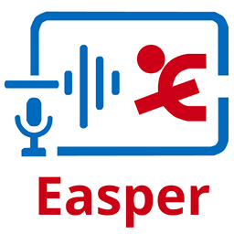

# EasperWeb

<div align="center">
  
  <h3>A Portable In-Browser Speech Recognition & Dataset Workflow for Field Linguists</h3>
  <p>
    100% Client-Side • Whisper ASR • Silero VAD • 3D-Speaker Diarization • Vertical Waveform Editor • Dataset Builder • PWA & Offline Ready
  </p>
</div>

---

## Overview

**EasperWeb** is a client-side web application and Progressive Web App (PWA) designed for field linguists, language documenters, and speech researchers. It enables transcription of field recordings, interactive audio segmentation, speaker diarization, and the preparation of fine-tuning datasets for OpenAI Whisper—all executing entirely inside the web browser without sending any audio or text data to external servers.

Powered by **Transformers.js v3** (`@huggingface/transformers`), **ONNX Runtime Web 1.30.0** (with **WebGPU hardware acceleration** and multi-threaded **WebAssembly SIMD**), and **Svelte 5**, Easper provides a portable, private, and zero-install environment for low-resource and endangered language documentation.

---

## Core Capabilities

### 1. Transcription Studio
- **Two-Step Structured Workflow**:
  - **Step 1: Audio & Segmentation (Silero VAD v5)**: Detects speech intervals, trims non-speech pauses, prevents silence hallucinations, and enables manual boundary adjustments.
  - **Step 2: Transcription Execution**: Transcribes detected speech intervals or empty segments with speech-to-text models.
- **Vertical Dual-Column Waveform Timeline**:
  - High-performance canvas-rendered vertical waveform synchronized with audio playback at 60 FPS.
  - Scrubbing, click-to-seek, interval drag handles, playback speed adjustments (0.5x – 1.5x), and zoom controls.
  - Context menu actions: split segment, merge with adjacent segment, transcribe single segment, play segment, or add segment.
- **Multiple Transcript Views**:
  - **Dialogue Segments**: Cards with speaker tags, boundary timestamps, inline text editing, and individual playback controls.
  - **Word / Token View**: Clickable token pills with start/end timestamps for fine-grained alignment.
  - **Plain Text View**: Clean text view with instant LTR $\leftrightarrow$ RTL text direction toggling for Arabic, Hebrew, Sorani Kurdish, and other right-to-left scripts.
  - **Statistics & Logs**: Metrics including duration, speech coverage, inference time, Real-Time Factor (RTF), and character counts.

### 2. Client-Side Speaker Diarization
- **100% In-Browser Diarization**: High-precision speaker clustering running locally on WebAssembly without cloud API calls.
- **Deep Speaker Embeddings**: Powered by **3D-Speaker CAM++** (`speech_campplus_sv_en_voxceleb_16k`, 512-dimensional embeddings) paired with Kaldi 80-channel Log Mel-Filterbank feature extraction.
- **Sliding-Window Sub-Segmentation**: Slices speech regions into overlapping windows (default 1.0s window, 0.5s step), capturing speaker transitions even during rapid dialogue.
- **Dual Execution Modes**:
  - *Fresh Segmentation*: Slices audio with Silero VAD, clusters windows globally with Agglomerative Hierarchical Clustering (AHC average linkage), and reconstructs speaker-bounded dialogue segments.
  - *Diarize Existing Segments*: Computes windowed embeddings for pre-existing or imported segments and applies multi-window majority voting to assign speakers while preserving transcripts and custom boundaries.

### 3. Dataset Builder (Whisper Fine-Tuning Pipeline)
A dedicated 7-step wizard to turn ELAN annotation files (`.eaf`) and paired audio recordings into a training package for Whisper:
1. **Select Files**: Ingest and automatically match `.eaf` files with audio recordings (`.wav`, `.mp3`, `.m4a`, `.ogg`, `.flac`) with a 50-pair safety limit to prevent browser memory crashes.
2. **Select Tiers**: Choose target orthographic transcription tiers and translation tiers across multiple speakers.
3. **Target Characters**: Extract unique character sets, view token frequencies, and configure custom character whitelists.
4. **Issues & Validation**: Automated scanning for unaligned records, overlapping timestamps, and segments exceeding maximum duration.
5. **Clean & Replace**: Clean up hesitation markers (`<hes>`), bracket tokens (`[laughter]`, `[inaudible]`), or apply custom literal/regex text replacement rules with drag-and-drop ordering and live previews.
6. **Dataset Review**: Review spoken token counts, vocabulary size, Type-Token Ratio (TTR), duration statistics, and configure train/val/test splits.
7. **Export**: Assemble and compress standard training archives (`.zip`) containing sliced 16 kHz mono WAV audio clips and metadata (`metadata.csv` / `dataset.jsonl`), ready for Google Colab or local GPU training.

### 4. Hybrid Compute Backends & Model Management
- **Hardware Acceleration (WebGPU)**: Executes models using WebGPU WGSL shaders with hardware-accelerated `MatMulNBits`, offering near-native GPU inference speeds in supported browsers.
- **Multi-Threaded CPU (WASM SIMD)**: Leverages 128-bit SIMD vectorization and multi-threading across physical CPU cores via `SharedArrayBuffer`.
- **Intelligent Quantization Routing**:
  - WebGPU uses hybrid precision (`{ encoder_model: 'fp32', decoder_model_merged: 'q4' }`) to circumvent known WebGPU INT8 shader attention bugs.
  - CPU WASM executes 8-bit quantized INT8 (`q8`) models with SIMD multi-threading.
- **Pre-Configured Models**: One-click download and offline caching for `whisper-base` and `whisper-small` from Hugging Face Hub.
- **Custom Local Models**: Load custom fine-tuned ONNX models directly from a folder on your computer via the File System Access API.

### 5. ELAN Interoperability & Multi-Tier Support
- **Bidirectional ELAN Support**: Ingest existing `.eaf` files alongside audio directly into Transcriber projects.
- **Dependent Sub-Tiers**: Configure up to 3 dependent sub-tiers per project (e.g., Translation, Morphology, Gloss, Notes, Phonetic) aligned 1-to-1 with parent speech utterances.
- **Export Options**:
  - **ELAN (`.eaf`)**: Full XML annotation format linked with audio file references, parent speech tiers, and dependent sub-tiers.
  - **SubRip Subtitles (`.srt`)**: Segment boundaries and formatted dialogue timestamps.
  - **Plain Text (`.txt`)**: Clean text transcript with speaker attributions and RTL support.
  - **Structured JSON (`.json`)**: Raw timestamp chunks, confidence scores, speaker tags, and sub-tier annotations.
  - **Processed Audio (`.wav`)**: Export project audio resampled to clean 16 kHz mono WAV.
  - **Dataset Package (`.zip`)**: Sliced audio clips and training manifests for Whisper fine-tuning.

---

## Technical Documentation

Detailed architecture specifications, tuning parameters, and integration guides are available in the [`docs/`](docs/) directory:

| Topic | Document | Focus Areas |
| :--- | :--- | :--- |
| **Speaker Diarization** | [Diarization Architecture & Parameter Tuning](docs/diarization.md) | 3D-Speaker CAM++ model, Kaldi FBank extraction, ONNX Runtime Web 1.30.0 requirements, AHC clustering, and tuning guide for noisy/rapid speech. |
| **Dataset Builder** | [Dataset Builder & Fine-Tuning Pipeline](docs/dataset-builder.md) | The 7-step wizard, string & token replacement engine, character whitelist extraction, validation checks, and ELAN annotation guidelines. |
| **Models & Runtimes** | [Model Management & Compute Runtimes](docs/models-and-runtimes.md) | WebGPU vs. WASM SIMD backends, cross-origin isolation, hybrid Q4/INT8 quantization, local folder loading, and offline storage. |
| **ELAN & Sub-Tiers** | [ELAN Integration, Sub-Tiers & Exports](docs/elan-and-subtiers.md) | Direct `.eaf` project import, multi-speaker tier mapping, dependent sub-tier architecture (Translation, Gloss), and export formats. |

---

## Getting Started

### Prerequisites
- [Bun](https://bun.sh/) (version 1.0 or higher recommended)
- A modern Chromium-based browser (Google Chrome, Brave, Microsoft Edge) or modern Firefox / Safari with WebAssembly SIMD and `SharedArrayBuffer` support. WebGPU support is recommended for accelerated GPU inference.

### Installation

1. **Clone the repository**:
   ```bash
   git clone https://github.com/Aso-UniMelb/EasperWeb.git
   cd EasperWeb
   ```

2. **Install dependencies**:
   ```bash
   bun install
   ```

3. **Run the development server**:
   ```bash
   bun run dev
   ```
   Open the displayed URL (typically `http://localhost:5173`) in your browser.

4. **Production Build & Preview**:
   ```bash
   bun run build
   bun run preview
   ```

---

## Offline & PWA Usage

Easper is fully installable as a Progressive Web App (PWA):
1. Navigate to the application in Chrome, Edge, or Brave.
2. Click the **Install** button in the header or the install icon in your browser's address bar.
3. Once installed, the Service Worker pre-caches all core runtime assets, enabling operation in remote field environments without internet connectivity.
4. Download your desired transcription model once in the **Model Manager** (`/models`) to store weights in local browser cache for offline transcription.

---

## Citation & Academic Use

If you use Easper in your research, please cite our paper accepted at the **Interspeech 2026** Conference:

> **Easper: An Accessible ASR Pipeline for Language Documentation**  
> Aso Mahmudi, Ting Dang, Ekaterina Vylomova, and Nick Thieberger  
> Paper: [arXiv:2608.11629](https://arxiv.org/abs/2608.11629)

```bibtex
@inproceedings{mahmudi26_interspeech,
  title={Easper: An Accessible ASR Pipeline for Language Documentation},
  author={Mahmudi, Aso and Dang, Ting and Vylomova, Ekaterina and Thieberger, Nick},
  booktitle={Interspeech 2026},
  year={2026}
}
```

---

## License

This project is open source and available under the **MIT License**.
